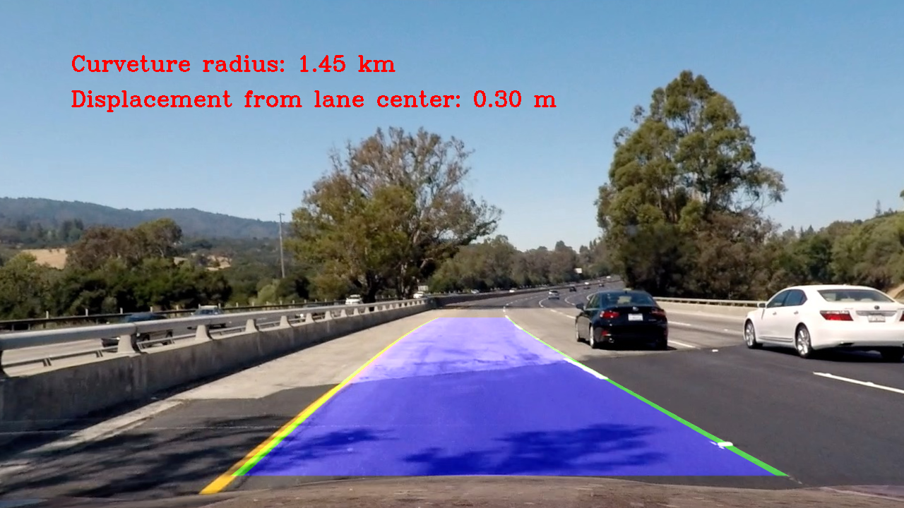

# Advanced Lane Finding
[](http://www.udacity.com/drive)

## Overview

In this project, a software pipeline was developed to identify the lane boundaries in images or videos. A classical computer vision approach relying on Channel transforms and gradients was adopted to tackle this problem.



The goals / steps of this project are the following:

* Compute the camera calibration matrix and distortion coefficients given a set of chessboard images.
* Apply a distortion correction to raw images.
* Use color transforms, gradients, etc., to create a thresholded binary image.
* Apply a perspective transform to rectify binary image ("birds-eye view").
* Detect lane pixels and fit to find the lane boundary.
* Determine the curvature of the lane and vehicle position with respect to center.
* Warp the detected lane boundaries back onto the original image.
* Output visual display of the lane boundaries and numerical estimation of lane curvature and vehicle position.

## Dependancies

- Python3
- NumPy
- OpenCV
- MoviePy
- Matplotlib
- pickle

## Usage

### Calibration:

The images for camera calibration are stored in the folder called `camera_cal`. To compute the camera calibration matrix and distortion coefficients, simply run the following command:
```
python calibrate.py camera_cal
```

### Running the pipeline:

#### Testing on images
To run the pipeline on a set of images, run the following command:
```
python main.py image input_directory output_directory
```
The script will automatically iterate through all the image in the directory and apply the pipeline. Sample images are provided in 
`test_images` with corresponding outputs in `output_images`.

#### Testing on a video
To run the script on an mp4 video, the following command can be used:
```
python main.py video path_to_video.mp4 output_video.mp4
```
A sample video is provided in `test_videos` with it's corresponding output in `output_videos`. Here's a link to my [video result](output_videos/project_video.mp4).


## Technical Overview
For more details regarding the technical implementation of the pipeline, refer to the [technical writeup](technical_writeup.md).

